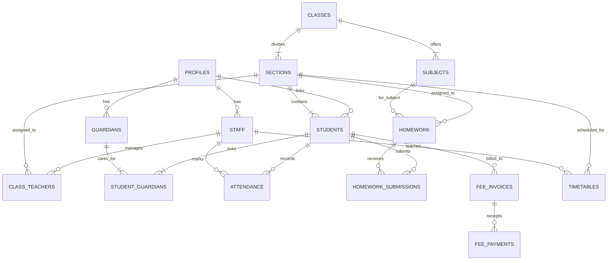

# Gyan Sthali School ERP — Data Model Documentation

This document defines the Postgres database schema, entity relationships, constraints, and Row Level Security (RLS) rules for **Gyan Sthali Public School ERP**.

---

## 1. Entity-Relationship Overview

---

## 2. Table Specifications

### 2.1 `profiles`
Central identity record linked to `auth.users(id)`.
- `id` (UUID, PK) -> `auth.users.id`
- `role` (ENUM: `admin`, `teacher`, `parent`, `student`, `accountant`)
- `full_name` (TEXT)
- `phone` (TEXT, indexed)
- `email` (TEXT)
- `avatar_url` (TEXT)

### 2.2 `academic_years`, `classes`, `sections`, `subjects`
Institutional academic hierarchy:
- `academic_years`: `id`, `name`, `start_date`, `end_date`, `is_current`
- `classes`: `id`, `name` (e.g. 'Class 5'), `order_index`
- `sections`: `id`, `class_id`, `name` (e.g. 'A'), `room_number`
- `subjects`: `id`, `class_id`, `name` ('Mathematics'), `code` ('MATH-5')

### 2.3 `students` & `guardians`
- `students`: `admission_number` (UNIQUE, e.g. 'GSPS-2021-482'), `first_name`, `last_name`, `first_name_hi`, `last_name_hi`, `roll_number`, `section_id`, `academic_year_id`, `date_of_birth`, `gender`, `category`, `is_rte`, `bus_route`, `emergency_phone`.
- `guardians`: `id`, `profile_id`, `first_name`, `last_name`, `relation` (`father`, `mother`, `guardian`), `phone`, `occupation`.
- `student_guardians`: Many-to-many junction (`student_id`, `guardian_id`, `is_primary`).

### 2.4 `attendance`
- `id` (UUID, PK)
- `student_id` (UUID, FK -> students.id)
- `date` (DATE)
- `status` (`present`, `absent`, `late`, `half_day`, `excused`)
- `remarks` (TEXT)
- `marked_by` (UUID, FK -> staff.id)
- Unique constraint: `(student_id, date)`

### 2.5 `notices`
- `id`, `title`, `title_hi`, `content`, `content_hi`, `category`, `priority`, `audience` (`all`, `parents`, `teachers`, `students`), `attachment_url`, `published_by`, `published_at`.

### 2.6 `homework` & `homework_submissions`
- `homework`: `id`, `section_id`, `subject_id`, `teacher_id`, `title`, `description`, `due_date`, `attachment_url`.
- `homework_submissions`: `id`, `homework_id`, `student_id`, `status` (`pending`, `submitted`, `graded`), `submission_text`, `file_url`, `marks_obtained`, `teacher_feedback`.

### 2.7 `timetables` & `calendar_events`
- `timetables`: `section_id`, `subject_id`, `staff_id`, `day_of_week` (1-6), `period_number` (1-8), `start_time`, `end_time`.
- `calendar_events`: `id`, `title`, `title_hi`, `event_type` (`holiday`, `exam`, `celebration`, `meeting`), `start_date`, `end_date`, `audience`.

### 2.8 `fee_invoices` & `fee_payments`
- `fee_invoices`: `id`, `student_id`, `quarter` (`Q1`-`Q4`), `total_amount`, `paid_amount`, `due_date`, `status` (`paid`, `partial`, `pending`, `overdue`).
- `fee_payments`: `id`, `invoice_id`, `student_id`, `amount`, `payment_method` (`cash`, `online_razorpay`, `upi`), `receipt_number`, `paid_at`.

---

## 3. Row Level Security (RLS) Matrix

| Table | Admin | Teacher | Parent | Student | Accountant |
|---|---|---|---|---|---|
| `profiles` | Full Access | Read own | Read own | Read own | Read own |
| `students` | Full Access | Read assigned classes | Read **only linked children** | Read **only self** | Read (fee link) |
| `guardians` | Full Access | Read class guardians | Read/Update own | No Access | Read |
| `attendance` | Full Access | Mark & view assigned classes | View **only linked children** | View **only self** | No Access |
| `homework` | Full Access | Create/manage own | View child's section | View own section | No Access |
| `notices` | Full Access | Create & view | View targeted ('all', 'parents') | View targeted | View |
| `fees` | Full Access | No Access | View child invoices & pay | View own invoices | Full Access |

---

## 4. Computed Views & Functions

1. `get_student_attendance_pct(student_id, month, year)`:
   Computes attendance percentage on server. Late/half-day counts as 0.5.
2. `calculate_fee_due(student_id)`:
   Computes total outstanding fee across all invoices.
3. `v_student_attendance_summary`:
   Aggregate view with `total_recorded_days`, `present_days`, `absent_days`, `attendance_percentage`, and CBSE threshold boolean `is_cbse_exam_eligible`.
4. `v_student_directory`:
   Denormalized view joining student, section, class, primary guardian, attendance % and fee balance.
